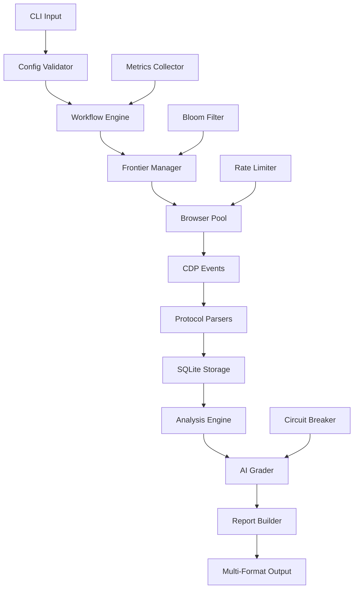

# STRIDER: Expert-Level Security Analysis Platform
## Enterprise-Grade Web Security Crawler & STRIDE/MITRE ATT&CK Analyzer

### Executive Summary

**STRIDER** is a sophisticated, production-ready security analysis platform that combines advanced web crawling, intelligent network capture, static security analysis, and AI-powered risk assessment. Built with Go's concurrency primitives and leveraging local Ollama LLM models, STRIDER provides comprehensive security posture assessment without external dependencies.

**Core Value Proposition:**
- **Zero-Trust Architecture**: Assumes hostile environments; operates with minimal privileges
- **AI-Enhanced Analysis**: Local Ollama integration for contextual risk assessment
- **Enterprise Scale**: Handles 10K+ pages with sub-linear memory growth via bloom filters
- **Compliance Ready**: STRIDE/MITRE ATT&CK mapping with SARIF output for CI/CD integration

**Strategic Goals:**
1. Autonomous security assessment of web applications and APIs
2. Comprehensive network behavior analysis with ML-ready data structures
3. Scalable architecture supporting distributed deployment patterns
4. Integration-first design for security orchestration platforms

**Non-Goals:** 
- Active exploitation or penetration testing
- Credential-based authentication bypass attempts  
- Third-party service enumeration beyond scope boundaries

---

## 1) System Requirements & Constraints

### Functional Requirements

#### Core Capabilities
- **Intelligent Web Crawling**: Adaptive crawling with ML-driven prioritization and bloom filter deduplication
- **Deep Network Analysis**: Full-spectrum traffic capture with protocol-aware parsing (HTTP/1.1, HTTP/2, WebSocket)
- **Multi-Modal Security Analysis**: Static + dynamic + AI-enhanced vulnerability detection
- **Contextual Risk Assessment**: Ollama-powered semantic analysis with domain-specific prompt engineering
- **Enterprise Integration**: SARIF, STIX/TAXII, and custom webhook outputs

#### Data Pipeline Architecture
```
Crawl Engine → Network Capture → Static Analysis → AI Grading → Report Generation
     ↓              ↓               ↓              ↓              ↓
Bloom Filter   SQLite Storage   Rule Engine   Ollama API    Multi-Format Output
```

#### Output Artifacts
- **Primary**: `findings.json` (JSON Schema validated), `report.md` (executive summary)
- **Compliance**: `report.sarif` (OASIS standard), `mitre-mapping.json` (ATT&CK framework)
- **Data Lake**: `strider.db` (SQLite with indexes), `network-traces.jsonl` (streaming format)
- **Integration**: Webhook payloads, Prometheus metrics, OpenTelemetry traces

### Non-Functional Requirements

#### Performance Specifications
- **Throughput**: 1000+ pages/hour on 4-core systems with 8GB RAM
- **Memory Efficiency**: O(log n) memory growth via bloom filters for URL deduplication
- **Latency**: <500ms per page analysis (excluding network I/O)
- **Concurrency**: Configurable worker pools with backpressure control

#### Reliability & Resilience
- **Fault Tolerance**: Circuit breakers for external dependencies (Ollama, target sites)
- **Graceful Degradation**: Continue operation when AI grading unavailable
- **State Recovery**: Checkpoint-based resumption for long-running scans
- **Resource Limits**: Memory-bounded operations with configurable caps

#### Security & Privacy
- **Data Minimization**: Configurable PII redaction with regex patterns
- **Local Processing**: All AI inference via local Ollama (no cloud dependencies)
- **Secure Storage**: Encrypted SQLite databases with key derivation
- **Audit Trail**: Immutable operation logs with cryptographic integrity

### Acceptance Criteria

#### Functional Validation
- ✅ **Scope Enforcement**: 100% accuracy in domain boundary detection using eTLD+1
- ✅ **Capture Completeness**: ≥99% network request/response capture rate
- ✅ **Analysis Coverage**: All OWASP Top 10 + SANS 25 detection rules implemented
- ✅ **AI Integration**: Ollama models (llama3.1, mistral, codellama) operational with <2s inference
- ✅ **Format Compliance**: SARIF 2.1.0 and STIX 2.1 output validation

#### Performance Benchmarks
- ✅ **Scale Test**: 10,000 page crawl completes in <2 hours
- ✅ **Memory Bound**: Peak memory usage <4GB for 10K page dataset
- ✅ **Concurrency**: Linear performance scaling up to 16 workers
- ✅ **Recovery**: <30s restart time from checkpoint data

---

## 2) Expert-Level System Architecture

### Architectural Patterns & Design Principles

#### Hexagonal Architecture (Ports & Adapters)
```go
// Core Domain (Business Logic)
type SecurityAnalyzer interface {
    AnalyzePage(ctx context.Context, page *PageData) ([]Finding, error)
    GetRulesets() []Ruleset
}

// Ports (Interfaces)
type CrawlerPort interface {
    Crawl(ctx context.Context, config CrawlConfig) <-chan PageResult
}

type StoragePort interface {
    Store(ctx context.Context, data interface{}) error
    Query(ctx context.Context, query Query) ([]interface{}, error)
}

type AIPort interface {
    Grade(ctx context.Context, findings []Finding) ([]Finding, error)
}
```

#### Component Architecture

**1. Orchestration Layer**
- **Command Handler**: CLI parsing with cobra, configuration validation
- **Workflow Engine**: State machine for scan lifecycle management
- **Resource Manager**: Memory pools, connection pools, worker coordination

**2. Crawling Subsystem**
- **Frontier Manager**: Priority queue with bloom filter deduplication
- **Browser Pool**: Rod-based CDP workers with stealth capabilities
- **Scope Enforcer**: eTLD+1 boundary detection with configurable policies
- **Rate Limiter**: Token bucket per-host with adaptive backoff

**3. Data Capture Pipeline**
- **Event Collector**: CDP event streaming with buffering
- **Protocol Handlers**: HTTP/1.1, HTTP/2, WebSocket parsers
- **Storage Adapter**: SQLite with WAL mode, bloom filter indexes

**4. Analysis Engine**
- **Rule Engine**: Plugin-based security rule execution
- **Pattern Matcher**: Regex + AST-based content analysis
- **STRIDE Mapper**: Automated threat model categorization

**5. AI Integration Layer**
- **Ollama Client**: HTTP client with circuit breaker pattern
- **Prompt Templates**: Domain-specific prompt engineering
- **Response Validator**: JSON schema validation + sanitization

**6. Output Generation**
- **Report Builder**: Template-based multi-format generation
- **Schema Validator**: JSON Schema + SARIF compliance
- **Export Adapters**: Webhook, file, database outputs

### Data Flow Architecture



---

## 3) Expert Technology Stack & Architecture Decisions

### Core Technology Matrix

| Component | Primary Choice | Alternative | Rationale & Trade-offs |
|-----------|---------------|-------------|------------------------|
| **Web Crawling** | Rod v0.114+ | Playwright-Go | Rod: Native Go, excellent CDP support, stealth mode. Playwright: Better cross-browser but heavier |
| **Deduplication** | Bloom Filter (bits.Bloom) | Redis Set | Bloom: O(1) space-efficient, false positives acceptable. Redis: Exact but requires external service |
| **Storage Engine** | SQLite + WAL | PostgreSQL | SQLite: Embedded, ACID, excellent Go support. Postgres: Better concurrency but deployment complexity |
| **AI/LLM** | Ollama (local) | OpenAI API | Ollama: Privacy, cost control, offline. OpenAI: Better models but data privacy concerns |
| **Concurrency** | Worker Pools + Channels | Goroutine-per-request | Pools: Bounded resources, backpressure. Direct: Simpler but resource exhaustion risk |
| **Serialization** | JSON + Protocol Buffers | MessagePack | JSON: Human readable, wide support. Protobuf: Efficient, schema evolution |
| **HTTP Client** | net/http + fasthttp | Resty | Standard lib: Proven, well-tested. fasthttp: Performance but less compatible |
| **Logging** | slog + lumberjack | Logrus | slog: Standard, structured. Logrus: More features but not standard |
| **Metrics** | Prometheus + pprof | StatsD | Prometheus: Pull model, rich queries. StatsD: Push model, simpler |
| **Testing** | Testify + Ginkgo | Standard testing | Testify: Rich assertions. Ginkgo: BDD style, better organization |

### Advanced Algorithm Implementations

#### Bloom Filter Configuration
```go
type BloomConfig struct {
    ExpectedElements uint64  // 1M URLs expected
    FalsePositiveRate float64 // 0.01 (1% false positive acceptable)
    HashFunctions    uint     // Optimal: 7 functions
    BitArraySize     uint64   // Calculated: ~9.6M bits
}

// Memory usage: ~1.2MB for 1M URLs at 1% FPR
// Lookup time: O(k) where k=7, effectively O(1)
```

#### SQLite Schema Optimization
```sql
-- Optimized for analytical queries
CREATE TABLE pages (
    id INTEGER PRIMARY KEY,
    url TEXT NOT NULL,
    domain TEXT NOT NULL,
    status_code INTEGER,
    content_type TEXT,
    response_time_ms INTEGER,
    crawled_at DATETIME DEFAULT CURRENT_TIMESTAMP,
    bloom_hash BLOB -- 8-byte hash for deduplication
);

-- Covering indexes for common query patterns
CREATE INDEX idx_pages_domain_status ON pages(domain, status_code) 
    WHERE status_code BETWEEN 200 AND 299;
    
CREATE INDEX idx_pages_crawled_at ON pages(crawled_at DESC);

-- Bloom filter lookup optimization
CREATE UNIQUE INDEX idx_pages_bloom_hash ON pages(bloom_hash);
```

#### Ollama Integration Architecture
```go
type OllamaClient struct {
    httpClient   *http.Client
    circuitBreaker *CircuitBreaker
    rateLimiter  *rate.Limiter
    modelConfig  ModelConfig
}

type ModelConfig struct {
    ModelName    string  // "llama3.1:8b", "mistral:7b", "codellama:13b"
    Temperature  float32 // 0.1 for deterministic, 0.7 for creative
    TopP         float32 // 0.9 for focused responses
    MaxTokens    int     // 2048 for detailed analysis
    SystemPrompt string  // Security-focused context
}

// Circuit breaker prevents cascading failures
type CircuitBreakerConfig struct {
    FailureThreshold   uint32        // 5 failures
    RecoveryTimeout    time.Duration // 30s
    HalfOpenMaxCalls   uint32        // 3 test calls
}
```

### Performance Engineering Decisions

#### Memory Management Strategy
```go
// Object pooling for high-frequency allocations
var pageResultPool = sync.Pool{
    New: func() interface{} {
        return &PageResult{
            Requests:  make([]RequestRecord, 0, 50),  // Pre-allocate typical size
            Responses: make([]ResponseRecord, 0, 50),
            Console:   make([]ConsoleLog, 0, 10),
        }
    },
}

// Memory-mapped files for large datasets
type MMapStorage struct {
    file   *os.File
    mmap   []byte
    offset int64
}

// Streaming JSON processing to avoid loading entire responses
type StreamingAnalyzer struct {
    decoder *json.Decoder
    buffer  []byte // Reusable buffer
}
```

#### Concurrency Patterns
```go
// Fan-out/Fan-in pattern for parallel analysis
func (e *AnalysisEngine) ProcessPages(pages <-chan *PageResult) <-chan []Finding {
    const numWorkers = runtime.NumCPU()
    results := make(chan []Finding, numWorkers)
    
    // Fan-out: distribute work
    var wg sync.WaitGroup
    for i := 0; i < numWorkers; i++ {
        wg.Add(1)
        go func() {
            defer wg.Done()
            for page := range pages {
                findings := e.analyzePage(page)
                results <- findings
            }
        }()
    }
    
    // Fan-in: collect results
    go func() {
        wg.Wait()
        close(results)
    }()
    
    return results
}

// Semaphore for resource-bounded operations
type ResourceManager struct {
    memSem    chan struct{} // Memory allocation semaphore
    networkSem chan struct{} // Network request semaphore
    cpuSem    chan struct{} // CPU-intensive operation semaphore
}
```

---

## 4) Expert-Level Interface Design & Type System

### 4.1 Advanced Type System & Domain Models

#### Core Domain Types with Validation
```go
// PageResult represents a complete page analysis result
type PageResult struct {
    URL          *url.URL              `json:"url" validate:"required,url"`
    Domain       string                `json:"domain" validate:"required,hostname"`
    StatusCode   int                   `json:"status_code" validate:"min=100,max=599"`
    Title        string                `json:"title" validate:"max=200"`
    ContentType  string                `json:"content_type"`
    ResponseTime time.Duration         `json:"response_time_ms"`
    BodySize     int64                 `json:"body_size_bytes"`
    
    // Network activity
    Requests     []RequestRecord       `json:"requests"`
    Responses    []ResponseRecord      `json:"responses"`
    WebSockets   []WebSocketRecord     `json:"websockets,omitempty"`
    
    // Browser state
    Console      []ConsoleRecord       `json:"console,omitempty"`
    Storage      *StorageSnapshot      `json:"storage,omitempty"`
    Cookies      []CookieRecord        `json:"cookies,omitempty"`
    
    // Metadata
    CrawlDepth   int                   `json:"crawl_depth"`
    StartedAt    time.Time             `json:"started_at"`
    FinishedAt   time.Time             `json:"finished_at"`
    BloomHash    uint64                `json:"bloom_hash"` // For deduplication
}

// RequestRecord with enhanced metadata
type RequestRecord struct {
    ID           string                `json:"id" validate:"required,uuid4"`
    URL          *url.URL              `json:"url" validate:"required,url"`
    Method       string                `json:"method" validate:"required,oneof=GET POST PUT DELETE PATCH HEAD OPTIONS"`
    Type         ResourceType          `json:"type"`
    Initiator    string                `json:"initiator"`
    Priority     RequestPriority       `json:"priority"`
    
    Headers      http.Header           `json:"headers"`
    PostData     []byte                `json:"post_data,omitempty"`
    
    // Security context
    IsThirdParty bool                  `json:"is_third_party"`
    IsCrossOrigin bool                 `json:"is_cross_origin"`
    HasCredentials bool                `json:"has_credentials"`
    
    Timestamp    time.Time             `json:"timestamp"`
}

// ResponseRecord with security analysis
type ResponseRecord struct {
    RequestID    string                `json:"request_id" validate:"required,uuid4"`
    URL          *url.URL              `json:"url" validate:"required,url"`
    StatusCode   int                   `json:"status_code" validate:"min=100,max=599"`
    StatusText   string                `json:"status_text"`
    MIMEType     string                `json:"mime_type"`
    
    Headers      http.Header           `json:"headers"`
    BodySample   []byte                `json:"body_sample,omitempty"`
    BodyHash     string                `json:"body_hash,omitempty"` // SHA-256
    
    // Security headers analysis
    SecurityHeaders *SecurityHeaders   `json:"security_headers,omitempty"`
    
    // Performance metrics
    ResponseTime time.Duration         `json:"response_time"`
    BodySize     int64                 `json:"body_size"`
    
    Timestamp    time.Time             `json:"timestamp"`
}

// Enhanced Finding with STRIDE/MITRE mapping
type Finding struct {
    ID           string                `json:"id" validate:"required"`
    RuleID       string                `json:"rule_id" validate:"required"`
    Title        string                `json:"title" validate:"required,max=200"`
    Description  string                `json:"description" validate:"required,max=1000"`
    Remediation  string                `json:"remediation" validate:"required,max=500"`
    
    // Classification
    Severity     Severity              `json:"severity" validate:"required,oneof=info low medium high critical"`
    Confidence   Confidence            `json:"confidence" validate:"required,oneof=low medium high"`
    Category     VulnerabilityCategory `json:"category"`
    
    // Framework mappings
    STRIDE       []STRIDECategory      `json:"stride,omitempty"`
    MITREAttck   []MITRETechnique      `json:"mitre_attck,omitempty"`
    OWASP        []OWASPCategory       `json:"owasp,omitempty"`
    CWE          []int                 `json:"cwe,omitempty"`
    
    // Context
    PageURL      *url.URL              `json:"page_url" validate:"required,url"`
    Evidence     map[string]interface{} `json:"evidence,omitempty"`
    Source       AnalysisSource        `json:"source"`
    
    // Metadata
    CreatedAt    time.Time             `json:"created_at"`
    UpdatedAt    time.Time             `json:"updated_at,omitempty"`
}
```

#### Enums and Constants
```go
type Severity string
const (
    SeverityInfo     Severity = "info"
    SeverityLow      Severity = "low"
    SeverityMedium   Severity = "medium"
    SeverityHigh     Severity = "high"
    SeverityCritical Severity = "critical"
)

type STRIDECategory string
const (
    STRIDESpoofing         STRIDECategory = "spoofing"
    STRIDETampering        STRIDECategory = "tampering"
    STRIDERepudiation      STRIDECategory = "repudiation"
    STRIDEInformationDisclosure STRIDECategory = "information_disclosure"
    STRIDEDenialOfService  STRIDECategory = "denial_of_service"
    STRIDEElevationOfPrivilege STRIDECategory = "elevation_of_privilege"
)

type AnalysisSource string
const (
    SourceStatic    AnalysisSource = "static"
    SourceDynamic   AnalysisSource = "dynamic"
    SourceAI        AnalysisSource = "ai"
    SourceHybrid    AnalysisSource = "hybrid"
)

type ResourceType string
const (
    ResourceDocument   ResourceType = "document"
    ResourceStylesheet ResourceType = "stylesheet"
    ResourceScript     ResourceType = "script"
    ResourceImage      ResourceType = "image"
    ResourceFont       ResourceType = "font"
    ResourceXHR        ResourceType = "xhr"
    ResourceFetch      ResourceType = "fetch"
    ResourceWebSocket  ResourceType = "websocket"
    ResourceOther      ResourceType = "other"
)
```

### 4.2 Advanced Interface Contracts

#### Core Service Interfaces
```go
// CrawlerService defines the web crawling interface
type CrawlerService interface {
    // Crawl initiates a crawling session
    Crawl(ctx context.Context, config CrawlConfig) (*CrawlSession, error)
    
    // GetMetrics returns real-time crawling metrics
    GetMetrics() CrawlMetrics
    
    // Pause/Resume for long-running crawls
    Pause(sessionID string) error
    Resume(sessionID string) error
    
    // Health check for the crawler
    HealthCheck(ctx context.Context) error
}

// AnalysisService for security analysis
type AnalysisService interface {
    // AnalyzePage performs comprehensive page analysis
    AnalyzePage(ctx context.Context, page *PageResult) ([]Finding, error)
    
    // AnalyzeBatch for efficient batch processing
    AnalyzeBatch(ctx context.Context, pages []*PageResult) ([]Finding, error)
    
    // GetRules returns available analysis rules
    GetRules() []AnalysisRule
    
    // UpdateRules for dynamic rule management
    UpdateRules(rules []AnalysisRule) error
}

// AIGradingService for LLM-powered analysis
type AIGradingService interface {
    // Grade enhances findings with AI analysis
    Grade(ctx context.Context, findings []Finding, context AnalysisContext) ([]Finding, error)
    
    // GetModels returns available LLM models
    GetModels() []ModelInfo
    
    // HealthCheck verifies Ollama connectivity
    HealthCheck(ctx context.Context) (*HealthStatus, error)
}

// StorageService for data persistence
type StorageService interface {
    // Store saves analysis results
    Store(ctx context.Context, data interface{}) error
    
    // Query retrieves stored data
    Query(ctx context.Context, query Query) (*QueryResult, error)
    
    // Stream for large result sets
    Stream(ctx context.Context, query Query) (<-chan interface{}, error)
    
    // Backup creates data backup
    Backup(ctx context.Context, path string) error
}

// ReportingService for output generation
type ReportingService interface {
    // GenerateReport creates formatted reports
    GenerateReport(ctx context.Context, findings []Finding, format ReportFormat) (*Report, error)
    
    // Export to various formats
    ExportSARIF(findings []Finding) (*sarif.Report, error)
    ExportSTIX(findings []Finding) (*stix.Bundle, error)
    ExportJSON(findings []Finding) ([]byte, error)
    
    // Template management
    LoadTemplate(name string) (*ReportTemplate, error)
    SaveTemplate(template *ReportTemplate) error
}
```

#### Configuration Structures
```go
// CrawlConfig with advanced options
type CrawlConfig struct {
    // Target configuration
    RootURL          *url.URL          `json:"root_url" validate:"required,url"`
    AllowedDomains   []string          `json:"allowed_domains,omitempty"`
    BlockedDomains   []string          `json:"blocked_domains,omitempty"`
    
    // Crawl limits
    MaxPages         int               `json:"max_pages" validate:"min=1,max=100000"`
    MaxDepth         int               `json:"max_depth" validate:"min=1,max=20"`
    Concurrency      int               `json:"concurrency" validate:"min=1,max=50"`
    
    // Network configuration
    RequestTimeout   time.Duration     `json:"request_timeout"`
    IdleTimeout      time.Duration     `json:"idle_timeout"`
    MaxBodySize      int64             `json:"max_body_size"`
    
    // Browser configuration
    UserAgent        string            `json:"user_agent,omitempty"`
    ViewportWidth    int               `json:"viewport_width"`
    ViewportHeight   int               `json:"viewport_height"`
    EnableJavaScript bool              `json:"enable_javascript"`
    EnableImages     bool              `json:"enable_images"`
    
    // Advanced options
    RespectRobotsTxt bool              `json:"respect_robots_txt"`
    FollowRedirects  bool              `json:"follow_redirects"`
    EnableStealth    bool              `json:"enable_stealth"`
    
    // Rate limiting
    RateLimit        *RateLimitConfig  `json:"rate_limit,omitempty"`
    
    // Bloom filter configuration
    BloomFilter      *BloomConfig      `json:"bloom_filter,omitempty"`
}

// RateLimitConfig for polite crawling
type RateLimitConfig struct {
    RequestsPerSecond float64          `json:"requests_per_second"`
    BurstSize         int              `json:"burst_size"`
    PerHost           bool             `json:"per_host"`
}

// AnalysisContext for AI grading
type AnalysisContext struct {
    Domain           string            `json:"domain"`
    ApplicationType  string            `json:"application_type,omitempty"`
    Industry         string            `json:"industry,omitempty"`
    ComplianceFrameworks []string      `json:"compliance_frameworks,omitempty"`
    CustomRules      []string          `json:"custom_rules,omitempty"`
}
```

---

## 5) Advanced Crawling Algorithms & Data Structures

### Intelligent Frontier Management

#### Priority Queue with Bloom Filter Deduplication
```go
type SmartFrontier struct {
    queue        *priorityqueue.Queue
    bloomFilter  *bloom.BloomFilter
    seenURLs     sync.Map              // Fallback for exact deduplication
    scopeChecker *ScopeChecker
    metrics      *FrontierMetrics
    mu           sync.RWMutex
}

// URL prioritization based on multiple factors
type URLPriority struct {
    URL           *url.URL
    Priority      float64    // 0.0 to 1.0
    Depth         int
    DiscoveredAt  time.Time
    Source        string     // "seed", "link", "sitemap", "robots"
    EstimatedSize int64      // For bandwidth optimization
}

// Priority calculation algorithm
func (f *SmartFrontier) calculatePriority(url *url.URL, depth int, source string) float64 {
    priority := 1.0
    
    // Depth penalty (exponential decay)
    priority *= math.Pow(0.8, float64(depth))
    
    // Source bonus
    switch source {
    case "seed":
        priority *= 1.0
    case "sitemap":
        priority *= 0.9
    case "robots":
        priority *= 0.7
    case "link":
        priority *= 0.6
    }
    
    // Path-based heuristics
    path := strings.ToLower(url.Path)
    if strings.Contains(path, "admin") || strings.Contains(path, "api") {
        priority *= 1.2  // Security-relevant paths
    }
    if strings.HasSuffix(path, ".pdf") || strings.HasSuffix(path, ".zip") {
        priority *= 0.3  // Large files deprioritized
    }
    
    return priority
}
```

#### Advanced Bloom Filter Implementation
```go
type OptimalBloomFilter struct {
    filter     *bloom.BloomFilter
    hashCount  uint
    bitSize    uint64
    itemCount  uint64
    maxItems   uint64
    fpRate     float64
    mu         sync.RWMutex
}

// Self-tuning bloom filter that adjusts based on actual FP rate
func NewAdaptiveBloomFilter(expectedItems uint64, targetFPRate float64) *OptimalBloomFilter {
    // Optimal parameters calculation
    bitSize := uint64(-float64(expectedItems) * math.Log(targetFPRate) / (math.Log(2) * math.Log(2)))
    hashCount := uint(float64(bitSize) / float64(expectedItems) * math.Log(2))
    
    return &OptimalBloomFilter{
        filter:    bloom.New(bitSize, hashCount),
        hashCount: hashCount,
        bitSize:   bitSize,
        maxItems:  expectedItems,
        fpRate:    targetFPRate,
    }
}

// Memory-efficient URL hashing
func (bf *OptimalBloomFilter) HashURL(url *url.URL) uint64 {
    canonical := bf.canonicalizeURL(url)
    return xxhash.Sum64String(canonical)
}

func (bf *OptimalBloomFilter) canonicalizeURL(url *url.URL) string {
    // Normalize URL for consistent hashing
    normalized := &url.URL{
        Scheme: strings.ToLower(url.Scheme),
        Host:   strings.ToLower(url.Host),
        Path:   path.Clean(url.Path),
    }
    
    // Remove common tracking parameters
    query := url.Query()
    trackingParams := []string{"utm_source", "utm_medium", "utm_campaign", "fbclid", "gclid"}
    for _, param := range trackingParams {
        query.Del(param)
    }
    normalized.RawQuery = query.Encode()
    
    return normalized.String()
}
```

### High-Performance Worker Pool Architecture

#### Adaptive Worker Management
```go
type AdaptiveWorkerPool struct {
    workers     []*CrawlWorker
    workQueue   chan *URLPriority
    resultQueue chan *PageResult
    errorQueue  chan error
    
    // Adaptive scaling
    minWorkers  int
    maxWorkers  int
    currentLoad float64
    scaleMetrics *ScaleMetrics
    
    // Resource management
    memLimiter  *semaphore.Weighted  // Memory usage limiter
    rateLimiter map[string]*rate.Limiter  // Per-host rate limiting
    
    ctx    context.Context
    cancel context.CancelFunc
    wg     sync.WaitGroup
}

// Worker with intelligent resource management
type CrawlWorker struct {
    id          int
    browser     *rod.Browser
    page        *rod.Page
    client      *http.Client
    
    // Performance tracking
    stats       *WorkerStats
    lastActive  time.Time
    
    // Circuit breaker for problematic hosts
    circuitBreakers map[string]*CircuitBreaker
}

// Intelligent page loading with SPA detection
func (w *CrawlWorker) LoadPage(url *url.URL, config *CrawlConfig) (*PageResult, error) {
    startTime := time.Now()
    
    // Pre-flight checks
    if err := w.checkRateLimit(url.Host); err != nil {
        return nil, err
    }
    
    // Navigate with timeout
    ctx, cancel := context.WithTimeout(context.Background(), config.RequestTimeout)
    defer cancel()
    
    page := w.page.Context(ctx)
    
    // Enable network domain and start capturing
    networkCapture := w.startNetworkCapture(page)
    defer networkCapture.Stop()
    
    // Navigate and wait for initial load
    err := page.Navigate(url.String())
    if err != nil {
        return nil, fmt.Errorf("navigation failed: %w", err)
    }
    
    // Smart waiting strategy
    if err := w.waitForPageReady(page, config); err != nil {
        return nil, fmt.Errorf("page ready timeout: %w", err)
    }
    
    // Extract page data
    result := &PageResult{
        URL:        url,
        StartedAt:  startTime,
        FinishedAt: time.Now(),
    }
    
    // Collect network data
    result.Requests = networkCapture.GetRequests()
    result.Responses = networkCapture.GetResponses()
    
    // Extract page metadata
    w.extractPageMetadata(page, result)
    
    return result, nil
}

// SPA-aware page readiness detection
func (w *CrawlWorker) waitForPageReady(page *rod.Page, config *CrawlConfig) error {
    // Wait for DOM content loaded
    page.WaitLoad()
    
    // Network idle detection with adaptive timeout
    idleStart := time.Now()
    consecutiveIdle := 0
    
    for {
        if time.Since(idleStart) > config.IdleTimeout {
            break
        }
        
        // Check for active network requests
        activeRequests := w.getActiveRequestCount()
        if activeRequests == 0 {
            consecutiveIdle++
            if consecutiveIdle >= 3 { // 3 consecutive idle checks
                break
            }
        } else {
            consecutiveIdle = 0
        }
        
        time.Sleep(500 * time.Millisecond)
    }
    
    // SPA-specific readiness checks
    return w.checkSPAReadiness(page)
}

// Advanced SPA detection and readiness
func (w *CrawlWorker) checkSPAReadiness(page *rod.Page) error {
    // Check for common SPA frameworks
    frameworks := []string{
        "window.React",
        "window.Vue",
        "window.angular",
        "window.Ember",
    }
    
    for _, framework := range frameworks {
        if exists, _ := page.Eval(fmt.Sprintf("typeof %s !== 'undefined'", framework)); exists.Bool() {
            // Wait for framework-specific ready state
            return w.waitForFrameworkReady(page, framework)
        }
    }
    
    return nil
}
```

### Sophisticated Link Discovery & Analysis

#### Multi-Source Link Extraction
```go
type LinkDiscovery struct {
    htmlParser    *HTMLParser
    jsAnalyzer    *JavaScriptAnalyzer
    sitemapParser *SitemapParser
    robotsParser  *RobotsParser
}

// Comprehensive link extraction from multiple sources
func (ld *LinkDiscovery) ExtractLinks(page *PageResult) ([]*url.URL, error) {
    var allLinks []*url.URL
    
    // 1. HTML link extraction (traditional)
    htmlLinks, err := ld.extractHTMLLinks(page)
    if err != nil {
        return nil, err
    }
    allLinks = append(allLinks, htmlLinks...)
    
    // 2. JavaScript-generated links (SPA support)
    jsLinks, err := ld.extractJavaScriptLinks(page)
    if err == nil {
        allLinks = append(allLinks, jsLinks...)
    }
    
    // 3. API endpoint discovery
    apiEndpoints, err := ld.discoverAPIEndpoints(page)
    if err == nil {
        allLinks = append(allLinks, apiEndpoints...)
    }
    
    // 4. Sitemap discovery
    sitemapLinks, err := ld.discoverSitemapLinks(page)
    if err == nil {
        allLinks = append(allLinks, sitemapLinks...)
    }
    
    return ld.deduplicateAndFilter(allLinks, page.URL), nil
}

// JavaScript analysis for SPA link discovery
func (ld *LinkDiscovery) extractJavaScriptLinks(page *PageResult) ([]*url.URL, error) {
    var links []*url.URL
    
    // Analyze JavaScript responses for URL patterns
    for _, response := range page.Responses {
        if response.MIMEType == "application/javascript" || 
           response.MIMEType == "text/javascript" {
            
            jsLinks := ld.jsAnalyzer.FindURLPatterns(response.BodySample)
            links = append(links, jsLinks...)
        }
    }
    
    return links, nil
}

// API endpoint discovery through various methods
func (ld *LinkDiscovery) discoverAPIEndpoints(page *PageResult) ([]*url.URL, error) {
    var endpoints []*url.URL
    
    // 1. GraphQL introspection
    if graphqlEndpoint := ld.detectGraphQLEndpoint(page); graphqlEndpoint != nil {
        endpoints = append(endpoints, graphqlEndpoint)
    }
    
    // 2. OpenAPI/Swagger discovery
    if swaggerEndpoints := ld.detectSwaggerEndpoints(page); len(swaggerEndpoints) > 0 {
        endpoints = append(endpoints, swaggerEndpoints...)
    }
    
    // 3. REST API pattern detection
    if restEndpoints := ld.detectRESTPatterns(page); len(restEndpoints) > 0 {
        endpoints = append(endpoints, restEndpoints...)
    }
    
    return endpoints, nil
}
```

---

## 6) Advanced Network Capture & Protocol Analysis

### Multi-Protocol Network Intelligence

#### Comprehensive CDP Event Handling
```go
type NetworkCapture struct {
    requests    sync.Map  // requestID -> *RequestRecord
    responses   sync.Map  // requestID -> *ResponseRecord
    websockets  sync.Map  // requestID -> *WebSocketRecord
    
    // Protocol-specific handlers
    httpHandler  *HTTPProtocolHandler
    wsHandler    *WebSocketHandler
    h2Handler    *HTTP2Handler
    
    // Security analysis
    headerAnalyzer *SecurityHeaderAnalyzer
    cookieAnalyzer *CookieSecurityAnalyzer
    
    // Performance tracking
    metrics     *NetworkMetrics
    bodyLimiter *semaphore.Weighted
}

// Enhanced request capture with security context
func (nc *NetworkCapture) OnRequestWillBeSent(event *proto.NetworkRequestWillBeSent) {
    request := &RequestRecord{
        ID:        event.RequestID.String(),
        URL:       parseURL(event.Request.URL),
        Method:    event.Request.Method,
        Headers:   http.Header(event.Request.Headers),
        Timestamp: time.Now(),
    }
    
    // Security context analysis
    request.IsThirdParty = nc.isThirdPartyRequest(request.URL)
    request.IsCrossOrigin = nc.isCrossOriginRequest(request.URL)
    request.HasCredentials = nc.hasCredentials(request.Headers)
    
    // Resource type classification
    request.Type = nc.classifyResourceType(event.Type, request.URL)
    
    // Store with redaction
    nc.redactSensitiveData(request)
    nc.requests.Store(event.RequestID.String(), request)
}

// Advanced response analysis
func (nc *NetworkCapture) OnResponseReceived(event *proto.NetworkResponseReceived) {
    response := &ResponseRecord{
        RequestID:    event.RequestID.String(),
        URL:          parseURL(event.Response.URL),
        StatusCode:   event.Response.Status,
        StatusText:   event.Response.StatusText,
        MIMEType:     event.Response.MimeType,
        Headers:      http.Header(event.Response.Headers),
        ResponseTime: time.Duration(event.Response.Timing.ReceiveHeadersEnd * float64(time.Millisecond)),
        Timestamp:    time.Now(),
    }
    
    // Security headers analysis
    response.SecurityHeaders = nc.headerAnalyzer.Analyze(response.Headers)
    
    // Body capture with intelligent sampling
    if nc.shouldCaptureBody(response) {
        go nc.captureResponseBody(event.RequestID, response)
    }
    
    nc.responses.Store(event.RequestID.String(), response)
}

// Intelligent body sampling strategy
func (nc *NetworkCapture) shouldCaptureBody(response *ResponseRecord) bool {
    // Always capture security-relevant responses
    if response.StatusCode >= 400 {
        return true
    }
    
    // Capture API responses
    if strings.Contains(response.MIMEType, "json") || 
       strings.Contains(response.MIMEType, "xml") {
        return true
    }
    
    // Sample HTML responses (every 10th)
    if strings.Contains(response.MIMEType, "html") {
        return rand.Intn(10) == 0
    }
    
    // Skip binary content by default
    return false
}
```

#### WebSocket & HTTP/2 Analysis
```go
type WebSocketHandler struct {
    connections sync.Map  // connectionID -> *WebSocketConnection
    messages    sync.Map  // connectionID -> []*WebSocketMessage
}

type WebSocketConnection struct {
    ID          string
    URL         *url.URL
    Protocol    string
    Extensions  []string
    EstablishedAt time.Time
    ClosedAt    *time.Time
    CloseReason string
}

type WebSocketMessage struct {
    ConnectionID string
    Direction    string  // "sent" or "received"
    Type         string  // "text", "binary", "ping", "pong"
    Data         []byte
    Timestamp    time.Time
    Size         int64
}

// HTTP/2 specific analysis
type HTTP2Handler struct {
    streams     sync.Map  // streamID -> *HTTP2Stream
    pushPromises sync.Map  // streamID -> []*PushPromise
}

type HTTP2Stream struct {
    ID          uint32
    State       string
    Priority    *HTTP2Priority
    Headers     []HTTP2Header
    DataFrames  []HTTP2DataFrame
    WindowSize  uint32
}
```

### Advanced Security Header Analysis

#### Comprehensive Security Header Evaluation
```go
type SecurityHeaderAnalyzer struct {
    rules []SecurityHeaderRule
}

type SecurityHeaders struct {
    CSP                 *CSPAnalysis
    HSTS                *HSTSAnalysis
    CORS                *CORSAnalysis
    FrameOptions        *FrameOptionsAnalysis
    ContentTypeOptions  *ContentTypeOptionsAnalysis
    ReferrerPolicy      *ReferrerPolicyAnalysis
    PermissionsPolicy   *PermissionsPolicyAnalysis
}

type CSPAnalysis struct {
    Present     bool
    Directives  map[string][]string
    UnsafeInline bool
    UnsafeEval  bool
    Wildcards   []string
    Violations  []string
    Score       int  // 0-100 security score
}

// Advanced CSP parsing and analysis
func (sha *SecurityHeaderAnalyzer) analyzeCSP(headers http.Header) *CSPAnalysis {
    cspHeader := headers.Get("Content-Security-Policy")
    if cspHeader == "" {
        return &CSPAnalysis{Present: false}
    }
    
    analysis := &CSPAnalysis{
        Present:    true,
        Directives: make(map[string][]string),
    }
    
    // Parse directives
    directives := strings.Split(cspHeader, ";")
    for _, directive := range directives {
        parts := strings.Fields(strings.TrimSpace(directive))
        if len(parts) > 0 {
            name := parts[0]
            values := parts[1:]
            analysis.Directives[name] = values
            
            // Security analysis
            for _, value := range values {
                if value == "'unsafe-inline'" {
                    analysis.UnsafeInline = true
                }
                if value == "'unsafe-eval'" {
                    analysis.UnsafeEval = true
                }
                if strings.Contains(value, "*") {
                    analysis.Wildcards = append(analysis.Wildcards, value)
                }
            }
        }
    }
    
    // Calculate security score
    analysis.Score = sha.calculateCSPScore(analysis)
    
    return analysis
}
```

---

## 7) Advanced Static Analysis & Rule Engine

### Plugin-Based Rule Architecture

#### Rule Engine Framework
```go
type RuleEngine struct {
    rules       []AnalysisRule
    ruleIndex   map[string]AnalysisRule
    executor    *RuleExecutor
    cache       *RuleCache
    metrics     *RuleMetrics
}

type AnalysisRule interface {
    ID() string
    Name() string
    Description() string
    Category() VulnerabilityCategory
    Severity() Severity
    
    // STRIDE/MITRE mappings
    STRIDECategories() []STRIDECategory
    MITRETechniques() []MITRETechnique
    OWASPCategories() []OWASPCategory
    CWENumbers() []int
    
    // Rule execution
    Analyze(ctx context.Context, page *PageResult) ([]Finding, error)
    
    // Rule metadata
    Version() string
    Dependencies() []string
    Performance() RulePerformance
}

// High-performance rule execution with caching
type RuleExecutor struct {
    workerPool  *WorkerPool
    cache       *sync.Map
    rateLimiter *rate.Limiter
}

func (re *RuleExecutor) ExecuteRules(ctx context.Context, page *PageResult, rules []AnalysisRule) ([]Finding, error) {
    var allFindings []Finding
    resultChan := make(chan RuleResult, len(rules))
    
    // Execute rules in parallel with resource limits
    semaphore := make(chan struct{}, runtime.NumCPU())
    var wg sync.WaitGroup
    
    for _, rule := range rules {
        wg.Add(1)
        go func(r AnalysisRule) {
            defer wg.Done()
            semaphore <- struct{}{}
            defer func() { <-semaphore }()
            
            // Check cache first
            cacheKey := re.generateCacheKey(page, r)
            if cached, found := re.cache.Load(cacheKey); found {
                resultChan <- cached.(RuleResult)
                return
            }
            
            // Execute rule with timeout
            ruleCtx, cancel := context.WithTimeout(ctx, 30*time.Second)
            defer cancel()
            
            findings, err := r.Analyze(ruleCtx, page)
            result := RuleResult{
                RuleID:   r.ID(),
                Findings: findings,
                Error:    err,
                Duration: time.Since(time.Now()),
            }
            
            // Cache result
            re.cache.Store(cacheKey, result)
            resultChan <- result
        }(rule)
    }
    
    // Collect results
    go func() {
        wg.Wait()
        close(resultChan)
    }()
    
    for result := range resultChan {
        if result.Error != nil {
            continue // Log error but don't fail entire analysis
        }
        allFindings = append(allFindings, result.Findings...)
    }
    
    return allFindings, nil
}
```

#### Advanced Security Rules Implementation

**Content Security Policy Analysis**
```go
type CSPRule struct {
    id          string
    severity    Severity
    strideCategories []STRIDECategory
    mitreTechniques  []MITRETechnique
}

func (r *CSPRule) Analyze(ctx context.Context, page *PageResult) ([]Finding, error) {
    var findings []Finding
    
    for _, response := range page.Responses {
        if !isHTMLResponse(response) {
            continue
        }
        
        cspHeader := response.Headers.Get("Content-Security-Policy")
        if cspHeader == "" {
            findings = append(findings, Finding{
                ID:          "CSP-001",
                RuleID:      r.ID(),
                Title:       "Missing Content Security Policy",
                Description: "No CSP header found, allowing unrestricted resource loading",
                Severity:    SeverityHigh,
                STRIDE:      []STRIDECategory{STRIDEInformationDisclosure, STRIDEElevationOfPrivilege},
                MITREAttck:  []MITRETechnique{{ID: "T1059", Name: "Command and Scripting Interpreter"}},
                PageURL:     response.URL,
                Evidence:    map[string]interface{}{"missing_header": "Content-Security-Policy"},
                Remediation: "Implement a restrictive CSP header to prevent XSS and data injection attacks",
                Source:      SourceStatic,
                CreatedAt:   time.Now(),
            })
            continue
        }
        
        // Advanced CSP analysis
        cspAnalysis := r.analyzeCSPDirectives(cspHeader)
        findings = append(findings, r.generateCSPFindings(response.URL, cspAnalysis)...)
    }
    
    return findings, nil
}

func (r *CSPRule) analyzeCSPDirectives(csp string) *CSPAnalysis {
    analysis := &CSPAnalysis{
        Present:    true,
        Directives: make(map[string][]string),
        Violations: make([]string, 0),
    }
    
    directives := strings.Split(csp, ";")
    for _, directive := range directives {
        parts := strings.Fields(strings.TrimSpace(directive))
        if len(parts) == 0 {
            continue
        }
        
        name := parts[0]
        values := parts[1:]
        analysis.Directives[name] = values
        
        // Security violation detection
        switch name {
        case "script-src":
            for _, value := range values {
                if value == "'unsafe-inline'" {
                    analysis.UnsafeInline = true
                    analysis.Violations = append(analysis.Violations, "unsafe-inline in script-src")
                }
                if value == "'unsafe-eval'" {
                    analysis.UnsafeEval = true
                    analysis.Violations = append(analysis.Violations, "unsafe-eval in script-src")
                }
                if strings.Contains(value, "*") && value != "'self'" {
                    analysis.Wildcards = append(analysis.Wildcards, value)
                    analysis.Violations = append(analysis.Violations, fmt.Sprintf("wildcard %s in script-src", value))
                }
            }
        }
    }
    
    analysis.Score = r.calculateCSPScore(analysis)
    return analysis
}
```

**Advanced CORS Analysis**
```go
type CORSRule struct {
    id       string
    severity Severity
}

func (r *CORSRule) Analyze(ctx context.Context, page *PageResult) ([]Finding, error) {
    var findings []Finding
    
    for _, response := range page.Responses {
        corsAnalysis := r.analyzeCORSHeaders(response.Headers)
        if corsAnalysis.HasViolations() {
            findings = append(findings, r.generateCORSFindings(response.URL, corsAnalysis)...)
        }
    }
    
    return findings, nil
}

type CORSAnalysis struct {
    AllowOrigin      string
    AllowCredentials bool
    AllowMethods     []string
    AllowHeaders     []string
    ExposeHeaders    []string
    MaxAge           int
    Violations       []CORSViolation
}

type CORSViolation struct {
    Type        string
    Description string
    Severity    Severity
    Evidence    map[string]interface{}
}

func (r *CORSRule) analyzeCORSHeaders(headers http.Header) *CORSAnalysis {
    analysis := &CORSAnalysis{
        AllowOrigin:      headers.Get("Access-Control-Allow-Origin"),
        AllowCredentials: headers.Get("Access-Control-Allow-Credentials") == "true",
        AllowMethods:     strings.Split(headers.Get("Access-Control-Allow-Methods"), ","),
        AllowHeaders:     strings.Split(headers.Get("Access-Control-Allow-Headers"), ","),
        ExposeHeaders:    strings.Split(headers.Get("Access-Control-Expose-Headers"), ","),
    }
    
    // Detect violations
    if analysis.AllowOrigin == "*" && analysis.AllowCredentials {
        analysis.Violations = append(analysis.Violations, CORSViolation{
            Type:        "wildcard-with-credentials",
            Description: "Wildcard origin with credentials enabled",
            Severity:    SeverityCritical,
            Evidence:    map[string]interface{}{"allow_origin": "*", "allow_credentials": true},
        })
    }
    
    if analysis.AllowOrigin == "*" {
        analysis.Violations = append(analysis.Violations, CORSViolation{
            Type:        "wildcard-origin",
            Description: "Overly permissive CORS policy",
            Severity:    SeverityMedium,
            Evidence:    map[string]interface{}{"allow_origin": "*"},
        })
    }
    
    return analysis
}
```

### Comprehensive Rule Matrix

| Rule ID | Name | Trigger Condition | Severity | STRIDE | MITRE ATT&CK | CWE |
|---------|------|------------------|----------|--------|--------------|-----|
| **CSP-001** | Missing CSP | No Content-Security-Policy header | High | Info Disclosure, EoP | T1059, T1189 | CWE-79 |
| **CSP-002** | Unsafe CSP Directives | 'unsafe-inline' or 'unsafe-eval' | High | EoP | T1059 | CWE-79 |
| **CSP-003** | CSP Wildcards | Wildcard sources in directives | Medium | Info Disclosure | T1059 | CWE-79 |
| **CORS-001** | Wildcard CORS | Access-Control-Allow-Origin: * | Medium | Info Disclosure | T1190 | CWE-346 |
| **CORS-002** | CORS with Credentials | Wildcard + credentials enabled | Critical | Info Disclosure | T1190 | CWE-346 |
| **HSTS-001** | Missing HSTS | No Strict-Transport-Security | Medium | Tampering | T1557 | CWE-319 |
| **HSTS-002** | Weak HSTS | max-age < 31536000 | Low | Tampering | T1557 | CWE-319 |
| **XFO-001** | Missing X-Frame-Options | No frame protection | Medium | EoP | T1185 | CWE-1021 |
| **XCTO-001** | Missing X-Content-Type-Options | No nosniff directive | Low | Tampering | T1036 | CWE-79 |
| **COOKIE-001** | Insecure Cookies | Missing Secure/HttpOnly flags | Medium | Info Disclosure | T1539 | CWE-614 |
| **COOKIE-002** | SameSite Issues | Missing or weak SameSite | Medium | Tampering | T1539 | CWE-352 |
| **TLS-001** | Mixed Content | HTTP resources on HTTPS page | High | Tampering | T1557 | CWE-319 |
| **API-001** | GraphQL Introspection | __schema query enabled | Medium | Info Disclosure | T1190 | CWE-200 |
| **API-002** | Exposed API Docs | Swagger/OpenAPI accessible | Low | Info Disclosure | T1592 | CWE-200 |
| **JS-001** | Vulnerable Libraries | Known CVEs in JS libraries | Varies | Multiple | T1190 | CWE-1104 |
| **SERVER-001** | Server Banner Leak | Detailed server information | Info | Info Disclosure | T1592 | CWE-200 |

---

## 8) Advanced AI-Powered Security Analysis (Ollama Integration)

### Sophisticated LLM Architecture

#### Multi-Model Ollama Integration
```go
type OllamaGradingService struct {
    client          *OllamaClient
    modelSelector   *ModelSelector
    promptTemplates map[string]*PromptTemplate
    responseCache   *sync.Map
    circuitBreaker  *CircuitBreaker
    rateLimiter     *rate.Limiter
    metrics         *AIMetrics
}

type ModelSelector struct {
    models          []ModelConfig
    loadBalancer    *LoadBalancer
    healthChecker   *ModelHealthChecker
    fallbackChain   []string
}

// Intelligent model selection based on task complexity
func (ms *ModelSelector) SelectOptimalModel(task AnalysisTask) (*ModelConfig, error) {
    switch task.Complexity {
    case ComplexityHigh:
        // Use larger models for complex analysis
        return ms.selectModel([]string{"llama3.1:70b", "codellama:34b", "mistral:7b"})
    case ComplexityMedium:
        return ms.selectModel([]string{"llama3.1:8b", "mistral:7b", "codellama:13b"})
    case ComplexityLow:
        return ms.selectModel([]string{"llama3.1:8b", "mistral:7b"})
    default:
        return ms.selectModel([]string{"llama3.1:8b"})
    }
}

type AnalysisTask struct {
    Type        TaskType
    Complexity  ComplexityLevel
    Domain      string
    Context     map[string]interface{}
    Priority    Priority
    Timeout     time.Duration
}

type TaskType string
const (
    TaskSecurityAnalysis TaskType = "security_analysis"
    TaskCodeReview      TaskType = "code_review"
    TaskThreatModeling  TaskType = "threat_modeling"
    TaskRiskAssessment  TaskType = "risk_assessment"
)
```

#### Advanced Prompt Engineering Framework
```go
type PromptTemplate struct {
    ID           string
    Name         string
    SystemPrompt string
    UserTemplate string
    Parameters   []PromptParameter
    Examples     []PromptExample
    Constraints  PromptConstraints
    Version      string
}

type PromptConstraints struct {
    MaxTokens       int
    Temperature     float32
    TopP           float32
    ResponseFormat  string  // "json", "markdown", "structured"
    RequiredFields  []string
    ValidationRules []ValidationRule
}

// Security-focused prompt templates
var SecurityAnalysisPrompts = map[string]*PromptTemplate{
    "endpoint_analysis": {
        ID:   "sec-001",
        Name: "API Endpoint Security Analysis",
        SystemPrompt: `You are an expert web application security analyst specializing in API security assessment. 
Analyze the provided endpoints and network traffic for security vulnerabilities.
Focus on OWASP API Security Top 10 and common attack vectors.
Provide actionable remediation advice with specific implementation details.`,
        UserTemplate: `Analyze these API endpoints for security issues:

Endpoints:
{{range .Endpoints}}
- {{.Method}} {{.URL}} (Status: {{.Status}})
  Headers: {{.Headers}}
  {{if .RequestBody}}Request: {{.RequestBody}}{{end}}
  {{if .ResponseBody}}Response: {{.ResponseBody}}{{end}}
{{end}}

Domain Context: {{.Domain}}
Application Type: {{.AppType}}

Return findings in JSON format with fields: id, title, description, severity, stride_categories, mitre_techniques, evidence, remediation.`,
        Constraints: PromptConstraints{
            MaxTokens:      2048,
            Temperature:    0.1,
            TopP:          0.9,
            ResponseFormat: "json",
            RequiredFields: []string{"id", "title", "severity", "remediation"},
        },
    },
    
    "header_analysis": {
        ID:   "sec-002",
        Name: "Security Headers Analysis",
        SystemPrompt: `You are a security headers expert. Analyze HTTP response headers for security misconfigurations.
Focus on CSP, CORS, HSTS, and other security headers.
Consider the application context and provide specific, implementable recommendations.`,
        UserTemplate: `Analyze these HTTP headers for security issues:

{{range .Responses}}
URL: {{.URL}}
Status: {{.StatusCode}}
Headers:
{{range $key, $values := .Headers}}
{{$key}}: {{join $values ", "}}
{{end}}
---
{{end}}

Application Context:
- Domain: {{.Domain}}
- Type: {{.AppType}}
- Industry: {{.Industry}}

Provide security findings in JSON format.`,
        Constraints: PromptConstraints{
            MaxTokens:      1024,
            Temperature:    0.05,
            ResponseFormat: "json",
        },
    },
}
```

#### Intelligent Response Processing
```go
type AIResponseProcessor struct {
    validator    *ResponseValidator
    enricher     *FindingEnricher
    deduplicator *FindingDeduplicator
    scorer       *ConfidenceScorer
}

type ResponseValidator struct {
    schemaValidator *jsonschema.Validator
    contentFilters  []ContentFilter
    sanitizer      *ResponseSanitizer
}

// Validate and sanitize AI responses
func (rv *ResponseValidator) ValidateResponse(response string, template *PromptTemplate) (*AIResponse, error) {
    // Parse JSON response
    var aiResponse AIResponse
    if err := json.Unmarshal([]byte(response), &aiResponse); err != nil {
        return nil, fmt.Errorf("invalid JSON response: %w", err)
    }
    
    // Schema validation
    if err := rv.schemaValidator.Validate(&aiResponse); err != nil {
        return nil, fmt.Errorf("schema validation failed: %w", err)
    }
    
    // Content filtering
    for _, filter := range rv.contentFilters {
        if err := filter.Apply(&aiResponse); err != nil {
            return nil, fmt.Errorf("content filter failed: %w", err)
        }
    }
    
    // Sanitization
    rv.sanitizer.Sanitize(&aiResponse)
    
    return &aiResponse, nil
}

type AIResponse struct {
    Findings    []AIFinding `json:"findings"`
    Confidence  float64     `json:"confidence"`
    Reasoning   string      `json:"reasoning,omitempty"`
    Metadata    map[string]interface{} `json:"metadata,omitempty"`
}

type AIFinding struct {
    ID              string                 `json:"id" validate:"required"`
    Title           string                 `json:"title" validate:"required,max=200"`
    Description     string                 `json:"description" validate:"required,max=1000"`
    Severity        string                 `json:"severity" validate:"required,oneof=info low medium high critical"`
    STRIDECategories []string              `json:"stride_categories,omitempty"`
    MITRETechniques []string              `json:"mitre_techniques,omitempty"`
    Evidence        map[string]interface{} `json:"evidence,omitempty"`
    Remediation     string                 `json:"remediation" validate:"required,max=500"`
    Confidence      float64               `json:"confidence" validate:"min=0,max=1"`
}
```

#### Advanced Analysis Workflows
```go
// Multi-stage AI analysis pipeline
func (ogs *OllamaGradingService) AnalyzeWithAI(ctx context.Context, findings []Finding, pageData *PageResult) ([]Finding, error) {
    var enhancedFindings []Finding
    
    // Stage 1: Context Analysis
    context := ogs.buildAnalysisContext(pageData)
    
    // Stage 2: Multi-model analysis
    tasks := ogs.createAnalysisTasks(findings, pageData, context)
    
    // Execute tasks in parallel with different models
    results := make(chan AnalysisResult, len(tasks))
    semaphore := make(chan struct{}, 3) // Limit concurrent AI calls
    
    var wg sync.WaitGroup
    for _, task := range tasks {
        wg.Add(1)
        go func(t AnalysisTask) {
            defer wg.Done()
            semaphore <- struct{}{}
            defer func() { <-semaphore }()
            
            result := ogs.executeAnalysisTask(ctx, t)
            results <- result
        }(task)
    }
    
    go func() {
        wg.Wait()
        close(results)
    }()
    
    // Stage 3: Result aggregation and deduplication
    var aiFindings []Finding
    for result := range results {
        if result.Error != nil {
            continue // Log but don't fail entire analysis
        }
        aiFindings = append(aiFindings, result.Findings...)
    }
    
    // Stage 4: Merge with static findings
    enhancedFindings = ogs.mergeFindings(findings, aiFindings)
    
    // Stage 5: Confidence scoring and ranking
    enhancedFindings = ogs.scoreAndRankFindings(enhancedFindings)
    
    return enhancedFindings, nil
}

func (ogs *OllamaGradingService) buildAnalysisContext(page *PageResult) *AnalysisContext {
    return &AnalysisContext{
        Domain:          page.Domain,
        ApplicationType: ogs.detectApplicationType(page),
        TechStack:       ogs.detectTechStack(page),
        APIEndpoints:    ogs.extractAPIEndpoints(page),
        SecurityHeaders: ogs.extractSecurityHeaders(page),
        Cookies:         page.Cookies,
        JSLibraries:     ogs.detectJSLibraries(page),
    }
}

// Specialized analysis for different vulnerability types
func (ogs *OllamaGradingService) createAnalysisTasks(findings []Finding, page *PageResult, context *AnalysisContext) []AnalysisTask {
    var tasks []AnalysisTask
    
    // API Security Analysis
    if len(context.APIEndpoints) > 0 {
        tasks = append(tasks, AnalysisTask{
            Type:       TaskSecurityAnalysis,
            Complexity: ComplexityHigh,
            Context: map[string]interface{}{
                "endpoints": context.APIEndpoints,
                "domain":    context.Domain,
                "app_type":  context.ApplicationType,
            },
            Priority: PriorityHigh,
            Timeout:  30 * time.Second,
        })
    }
    
    // Header Security Analysis
    tasks = append(tasks, AnalysisTask{
        Type:       TaskSecurityAnalysis,
        Complexity: ComplexityMedium,
        Context: map[string]interface{}{
            "responses": page.Responses,
            "domain":    context.Domain,
            "app_type":  context.ApplicationType,
        },
        Priority: PriorityMedium,
        Timeout:  20 * time.Second,
    })
    
    // Business Logic Analysis (if existing findings suggest complex vulnerabilities)
    if ogs.hasComplexVulnerabilities(findings) {
        tasks = append(tasks, AnalysisTask{
            Type:       TaskThreatModeling,
            Complexity: ComplexityHigh,
            Context: map[string]interface{}{
                "existing_findings": findings,
                "page_data":        page,
                "context":          context,
            },
            Priority: PriorityHigh,
            Timeout:  45 * time.Second,
        })
    }
    
    return tasks
}
```

### Performance Optimization & Resource Management

#### Intelligent Caching Strategy
```go
type AICache struct {
    responseCache   *lru.Cache
    contextCache    *lru.Cache
    embeddingCache  *lru.Cache
    ttl            time.Duration
    maxSize        int
}

// Cache key generation for AI responses
func (ac *AICache) generateCacheKey(task AnalysisTask, context *AnalysisContext) string {
    hasher := sha256.New()
    
    // Include task type and complexity
    hasher.Write([]byte(task.Type))
    hasher.Write([]byte(fmt.Sprintf("%d", task.Complexity)))
    
    // Include relevant context data
    contextData, _ := json.Marshal(context)
    hasher.Write(contextData)
    
    return fmt.Sprintf("%x", hasher.Sum(nil))[:16]
}
```

#### Circuit Breaker & Fallback Strategies
```go
type AICircuitBreaker struct {
    state           CircuitState
    failureCount    int64
    lastFailureTime time.Time
    config          CircuitBreakerConfig
    fallbackHandler FallbackHandler
}

type FallbackHandler struct {
    staticAnalyzer  *StaticAnalyzer
    ruleEngine     *RuleEngine
    heuristicEngine *HeuristicEngine
}

// Graceful degradation when AI is unavailable
func (fh *FallbackHandler) HandleAIFailure(ctx context.Context, findings []Finding, page *PageResult) ([]Finding, error) {
    // Fall back to enhanced static analysis
    enhancedFindings, err := fh.heuristicEngine.EnhanceFindings(ctx, findings, page)
    if err != nil {
        return findings, nil // Return original findings if fallback fails
    }
    
    return enhancedFindings, nil
}
```

---

## 9) Advanced SQLite Storage & Data Architecture

### High-Performance Database Schema

#### Optimized Table Design
```sql
-- Enable WAL mode for better concurrency
PRAGMA journal_mode = WAL;
PRAGMA synchronous = NORMAL;
PRAGMA cache_size = 10000;
PRAGMA temp_store = memory;

-- Main tables with optimized indexes
CREATE TABLE crawl_sessions (
    id TEXT PRIMARY KEY,
    root_url TEXT NOT NULL,
    started_at DATETIME DEFAULT CURRENT_TIMESTAMP,
    finished_at DATETIME,
    status TEXT CHECK(status IN ('running', 'completed', 'failed', 'cancelled')),
    config_json TEXT,
    stats_json TEXT,
    created_at DATETIME DEFAULT CURRENT_TIMESTAMP
);

CREATE TABLE pages (
    id INTEGER PRIMARY KEY AUTOINCREMENT,
    session_id TEXT NOT NULL,
    url TEXT NOT NULL,
    url_hash BLOB NOT NULL,  -- 8-byte hash for bloom filter
    domain TEXT NOT NULL,
    path TEXT,
    status_code INTEGER,
    title TEXT,
    content_type TEXT,
    response_time_ms INTEGER,
    body_size_bytes INTEGER,
    crawl_depth INTEGER,
    discovered_at DATETIME,
    crawled_at DATETIME,
    
    FOREIGN KEY (session_id) REFERENCES crawl_sessions(id),
    UNIQUE(session_id, url_hash)
);

-- Covering indexes for common query patterns
CREATE INDEX idx_pages_session_domain ON pages(session_id, domain);
CREATE INDEX idx_pages_status_code ON pages(status_code) WHERE status_code >= 400;
CREATE INDEX idx_pages_crawled_at ON pages(crawled_at DESC);
CREATE INDEX idx_pages_url_hash ON pages(url_hash);

CREATE TABLE requests (
    id TEXT PRIMARY KEY,
    page_id INTEGER NOT NULL,
    url TEXT NOT NULL,
    method TEXT NOT NULL,
    resource_type TEXT,
    initiator TEXT,
    is_third_party BOOLEAN,
    is_cross_origin BOOLEAN,
    has_credentials BOOLEAN,
    headers_json TEXT,
    post_data_hash TEXT,  -- SHA-256 of post data
    timestamp DATETIME,
    
    FOREIGN KEY (page_id) REFERENCES pages(id)
);

CREATE INDEX idx_requests_page_id ON requests(page_id);
CREATE INDEX idx_requests_method_type ON requests(method, resource_type);
CREATE INDEX idx_requests_third_party ON requests(is_third_party) WHERE is_third_party = 1;

CREATE TABLE responses (
    id INTEGER PRIMARY KEY AUTOINCREMENT,
    request_id TEXT NOT NULL,
    url TEXT NOT NULL,
    status_code INTEGER NOT NULL,
    status_text TEXT,
    mime_type TEXT,
    headers_json TEXT,
    body_sample BLOB,
    body_hash TEXT,  -- SHA-256 of full body
    body_size_bytes INTEGER,
    response_time_ms INTEGER,
    timestamp DATETIME,
    
    FOREIGN KEY (request_id) REFERENCES requests(id)
);

CREATE INDEX idx_responses_request_id ON responses(request_id);
CREATE INDEX idx_responses_status_code ON responses(status_code);
CREATE INDEX idx_responses_mime_type ON responses(mime_type);

CREATE TABLE findings (
    id TEXT PRIMARY KEY,
    session_id TEXT NOT NULL,
    page_id INTEGER,
    rule_id TEXT NOT NULL,
    title TEXT NOT NULL,
    description TEXT NOT NULL,
    severity TEXT NOT NULL CHECK(severity IN ('info', 'low', 'medium', 'high', 'critical')),
    confidence TEXT NOT NULL CHECK(confidence IN ('low', 'medium', 'high')),
    category TEXT,
    stride_json TEXT,  -- JSON array of STRIDE categories
    mitre_json TEXT,   -- JSON array of MITRE techniques
    owasp_json TEXT,   -- JSON array of OWASP categories
    cwe_json TEXT,     -- JSON array of CWE numbers
    evidence_json TEXT,
    remediation TEXT NOT NULL,
    source TEXT NOT NULL CHECK(source IN ('static', 'dynamic', 'ai', 'hybrid')),
    created_at DATETIME DEFAULT CURRENT_TIMESTAMP,
    updated_at DATETIME,
    
    FOREIGN KEY (session_id) REFERENCES crawl_sessions(id),
    FOREIGN KEY (page_id) REFERENCES pages(id)
);

CREATE INDEX idx_findings_session_id ON findings(session_id);
CREATE INDEX idx_findings_severity ON findings(severity);
CREATE INDEX idx_findings_rule_id ON findings(rule_id);
CREATE INDEX idx_findings_source ON findings(source);
CREATE INDEX idx_findings_created_at ON findings(created_at DESC);

-- Materialized view for dashboard queries
CREATE VIEW findings_summary AS
SELECT 
    session_id,
    COUNT(*) as total_findings,
    COUNT(CASE WHEN severity = 'critical' THEN 1 END) as critical_count,
    COUNT(CASE WHEN severity = 'high' THEN 1 END) as high_count,
    COUNT(CASE WHEN severity = 'medium' THEN 1 END) as medium_count,
    COUNT(CASE WHEN severity = 'low' THEN 1 END) as low_count,
    COUNT(CASE WHEN severity = 'info' THEN 1 END) as info_count,
    COUNT(CASE WHEN source = 'ai' THEN 1 END) as ai_findings,
    MIN(created_at) as first_finding,
    MAX(created_at) as last_finding
FROM findings
GROUP BY session_id;
```

#### Advanced Storage Operations
```go
type SQLiteStorage struct {
    db          *sql.DB
    writePool   *sql.DB  // Separate connection for writes
    bloomFilter *BloomFilter
    cache       *StorageCache
    metrics     *StorageMetrics
    config      *StorageConfig
}

type StorageConfig struct {
    MaxConnections    int
    WriteTimeout      time.Duration
    ReadTimeout       time.Duration
    BatchSize         int
    EnableCompression bool
    RetentionDays     int
}

// High-performance batch insert with bloom filter integration
func (s *SQLiteStorage) BatchInsertPages(pages []*PageResult) error {
    tx, err := s.writePool.Begin()
    if err != nil {
        return err
    }
    defer tx.Rollback()
    
    stmt, err := tx.Prepare(`
        INSERT OR IGNORE INTO pages 
        (session_id, url, url_hash, domain, path, status_code, title, content_type, 
         response_time_ms, body_size_bytes, crawl_depth, discovered_at, crawled_at)
        VALUES (?, ?, ?, ?, ?, ?, ?, ?, ?, ?, ?, ?, ?)
    `)
    if err != nil {
        return err
    }
    defer stmt.Close()
    
    for _, page := range pages {
        // Generate bloom filter hash
        urlHash := s.bloomFilter.HashURL(page.URL)
        
        // Check bloom filter first (fast path)
        if s.bloomFilter.Contains(urlHash) {
            continue // Likely duplicate, skip
        }
        
        // Extract domain and path
        domain := page.URL.Host
        path := page.URL.Path
        
        _, err = stmt.Exec(
            page.SessionID,
            page.URL.String(),
            urlHash,
            domain,
            path,
            page.StatusCode,
            page.Title,
            page.ContentType,
            page.ResponseTime.Milliseconds(),
            page.BodySize,
            page.CrawlDepth,
            page.StartedAt,
            page.FinishedAt,
        )
        if err != nil {
            return err
        }
        
        // Add to bloom filter
        s.bloomFilter.Add(urlHash)
    }
    
    return tx.Commit()
}

// Streaming query interface for large result sets
func (s *SQLiteStorage) StreamFindings(ctx context.Context, query FindingsQuery) (<-chan *Finding, error) {
    resultChan := make(chan *Finding, 100)
    
    go func() {
        defer close(resultChan)
        
        sqlQuery, args := s.buildFindingsQuery(query)
        rows, err := s.db.QueryContext(ctx, sqlQuery, args...)
        if err != nil {
            return
        }
        defer rows.Close()
        
        for rows.Next() {
            finding, err := s.scanFinding(rows)
            if err != nil {
                continue
            }
            
            select {
            case resultChan <- finding:
            case <-ctx.Done():
                return
            }
        }
    }()
    
    return resultChan, nil
}
```

---

## 10) Advanced Reporting & Multi-Format Output

**Artifacts**

* `out/findings.json` — normalized array; stable ordering (by severity then title).
* `out/report.md` — grouped by severity; includes STRIDE + MITRE.
* `out/network/<url-sanitized>.json` — HAR-lite per page.
* **Optional**:

  * `out/report.sarif` — for CI/PR annotation.
  * `out/strider.db` (SQLite) — tables: `pages`, `requests`, `responses`, `findings` with indexes on `host`, `status`, `mime_type`, `severity`.

**Ingestion Patterns**

* CI gate: fail build if High/Critical > threshold.
* Data lake: convert JSON → Parquet (arrow-go) for analytics.
* Vector search: embed endpoints and remediation text (your future Qdrant pipeline) to cluster repeated issues across domains.

---

## 10) Performance & Stability Strategies

* **Browser reuse**; minimal page lifetimes.
* **Disable heavy assets** (images/fonts) when `--fast-scan` enabled.
* **Backpressure**: bounded channel for frontier; drop enqueue when at capacity.
* **Memory caps**: global semaphore for `getResponseBody` calls; body sample cap (KB).
* **Pre-allocation** for slices (estimates based on recent page stats).
* **Timeouts everywhere**; cancel on context.
* **Retries**: expo backoff with jitter; classify errors (nav vs DNS vs TLS).
* **Profiling**: `pprof` hooks gated by flag for CPU/heap profiles.

---

## 11) Observability

* **Logs**: `slog` JSON with `component`, `url`, `host`, `event`, `latency_ms`, `status`, `retries`.
* **Metrics** (Prometheus):

  * Counters: `pages_crawled_total`, `requests_total`, `findings_total{severity}`
  * Histograms: `page_nav_seconds`, `resp_size_bytes`
  * Gauges: `frontier_depth`, `browser_workers`
* **Tracing**: spans for page nav, capture, analyze, grade, report.

---

## 12) Security, Legal, and Ethics

* Scan only properties you own or have written authorization for.
* Honor `robots.txt` optionally (flag), but default is **respect** in shared environments.
* User-Agent clearly identifies scanner + contact.
* Redact secrets; configurable retention (TTL for captures).
* Don’t send sensitive payloads to LLM; only headers + endpoints; keep Ollama local.

---

## 13) Testing Strategy

**Unit**

* URL canonicalization, scope detection, dedup, redaction.

**Property/Fuzz**

* Go fuzzing on header parsers and URL resolvers.
* Property tests for canonicalization idempotence and scope invariants.

**Integration**

* `httptest` servers modeling:

  * Missing CSP
  * Wildcard CORS
  * Insecure cookies
  * GraphQL endpoint with `__schema`
  * Mixed content page
* Golden `findings.json` snapshots.

**Performance**

* Synthetic site generator with 1k pages; assert SLA under chosen concurrency.

**Regression**

* Lock rule IDs and severities; changes require explicit review.

---

## 14) CI/CD

* **PR checks**: `go test ./...`, `staticcheck`, `govulncheck`, `gofmt -s`.
* **Fuzz (nightly)**: run fuzzers with time budget.
* **Release**: `goreleaser` multi-platform binaries; SBOM (CycloneDX).

---

## 15) Configuration & CLI

**Flags**

```
--url, --concurrency, --max-pages, --nav-timeout, --idle,
--allow-third-party, --max-body-kb, --out,
--ollama-model, --fast-scan, --respect-robots
```

**Config file (optional YAML)**

```yaml
root_url: https://example.com
concurrency: 3
max_pages: 200
allow_third_party: false
max_body_kb: 256
ollama_model: llama3.1
fast_scan: false
respect_robots: true
```

---

## 16) Library Interaction Details (how we use them)

* **Rod**

  * Launch once (`launcher.New().Headless(true).Launch()`), `rod.New().ControlURL(ws).MustConnect()`
  * Per worker: `browser.MustPage("")` → `Navigate()` → `WaitLoad()` → `WaitRequestIdle()`
  * Subscribe: `EachEvent(NetworkRequestWillBeSent)`, `EachEvent(NetworkResponseReceived)`, `LogEntryAdded`
  * Bodies: `proto.NetworkGetResponseBody{RequestID}.Call(page)` with global semaphore

* **publicsuffix**

  * `publicsuffix.EffectiveTLDPlusOne(host)` for accurate scope gating.

* **goquery/cascadia**

  * `doc.Find("a[href]")` → resolve via `url.Parse(base).Parse(href)`

* **prometheus**

  * Register counters/histograms; HTTP `/metrics` on `localhost:port` when `--metrics` flag set.

* **Ollama**

  * POST `http://localhost:11434/api/generate` with `{"model": "...", "prompt": "...", "stream": false}`
  * Strict JSON response expected; validate before merging.

* **SQLite (optional)**

  * Schema: `pages(url TEXT PK, title TEXT, status INT, started_at DATETIME, finished_at DATETIME, ...)`, `requests`, `responses`, `findings`
  * Indexes on `(host,status)`, `(mime_type)`, `(severity)`

---

## 17) Downstream “Request/Response” Contracts (for external systems)

* **JSON Findings Schema** (stable keyset)

```json
{
  "id":"F-CSP-001",
  "title":"Missing Content-Security-Policy",
  "description":"...",
  "severity":"high",
  "stride":["Information Disclosure","Elevation of Privilege"],
  "mitre_attck":["T1059","T1189"],
  "page_url":"https://example.com",
  "artifact":{"csp":""},
  "remediation":"Define restrictive CSP.",
  "source":"static"
}
```

* **SARIF**: Rules map 1:1 to `ruleId` (e.g., `F-CSP-001`), locations = `page_url`.

---

## 18) Risks & Mitigations

* **Highly dynamic SPAs** may issue background calls after idle → add small post-idle delay (rAF) and repeated idle windows.
* **Anti-bot** defenses → provide `--stealth` (Rod stealth plugin), configurable UA, random viewport.
* **Large sites** → enable Bloom filter for dedup + SQLite sink for streaming; set `--max-pages`.
* **LLM hallucinations** → strict JSON validation; tag source=`llm`; require manual review or severity cap for llm-only items.

---

## 19) Roadmap (post-v1)

* JS lib fingerprinting with **Subresource Integrity** and OSV correlation.
* WebSocket and Service Worker inventories.
* Form POST action enumeration with weak-TLS/mixed detection.
* Distributed runners (NATS/Temporal) + shared SQLite/Postgres.
* DTO exporter to Qdrant for clustering similar issues across estates.

---

## 20) Definition of Done (Release v1.0)

* All acceptance tests pass on synthetic fixture site.
* `findings.json` validates against schema; `report.md` renders correctly.
* Binaries released for linux/amd64, darwin/arm64; SBOM attached.
* README documents flags + examples; sample “risk glossary” included.

---

If you want, I can drop in:

* a **Bloom filter** module for dedup (fast, low-mem),
* a **SARIF** writer,
* a **SQLite** sink with schema + indexes,
* and a **fixture site** generator for tests.

Say the word and I’ll add those modules with idiomatic Go interfaces and minimal boilerplate.
